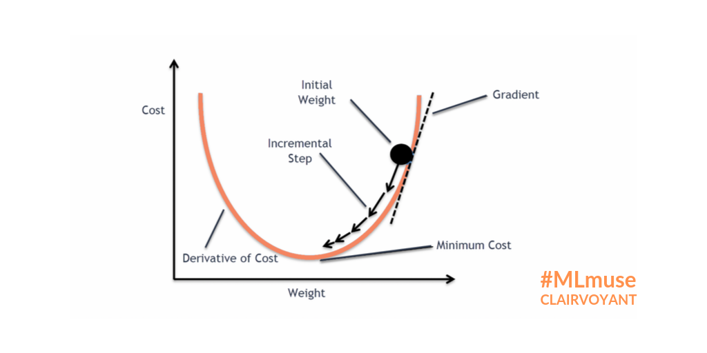

# Table of Contents.
- [14 July 2025](#14-july-2025)
    - [Gradient descent](#gradient-descent)

## 14 July 2025

## Gradient descent
- minimize the error wrt the weight of the neural network
- the learning rate determines the step size of the update used to reach the minimum.

> 
 epoch? The number of complete passes through the training dataset.

- each step size is the learning rate.

-  when the network or model is not fitting the data well, it is said to be underfitting.
- when the network or model is fitting the data too well, it is said to be overfitting.
- the goal is to find a balance between underfitting and overfitting,

## Backpropagation
- Backpropagation is the algorithm used to train neural networks.
- It works by computing the gradient of the loss function with respect to each weight by the chain rule, allowing for efficient computation of gradients.
- The gradients are then used to update the weights in the direction that reduces the loss.
### what is loss function?

- when we increase the weight, the loss function increases, and when we decrease the weight, the loss function decreases.
- The loss function measures how well the model is performing.

$$w_{new} = w_{old} - \eta \frac{\partial E}{\partial w}$$
where:
- \(w_{new}\) is the updated weight
- \(w_{old}\) is the current weight
- \(\eta\) is the learning rate
- \(\frac{\partial E}{\partial w}\) is the gradient of the loss
function with respect to the weight
- \(E\) is the loss function    