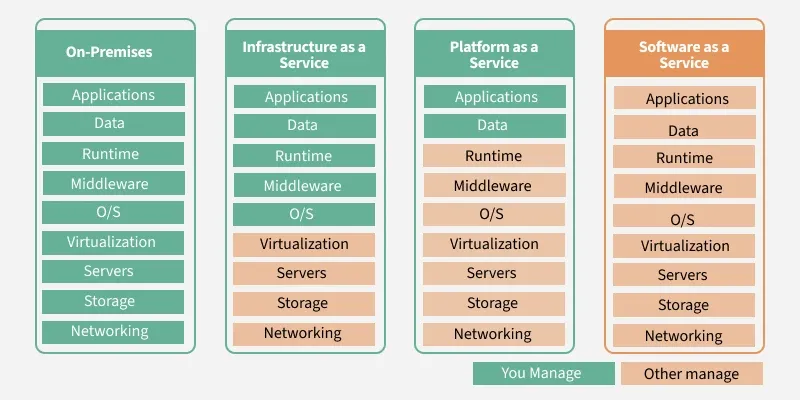
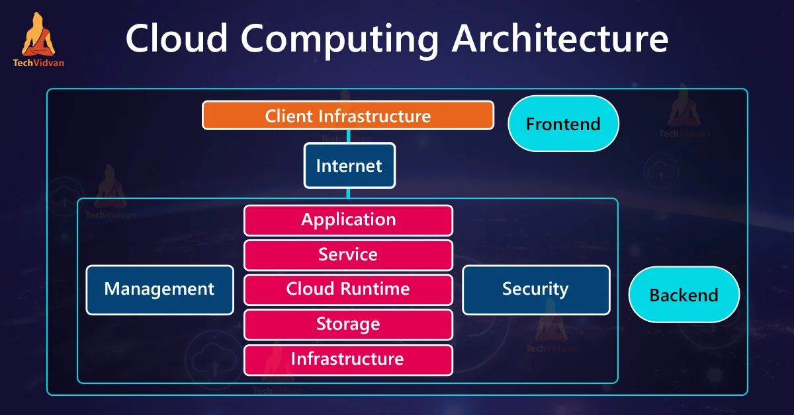
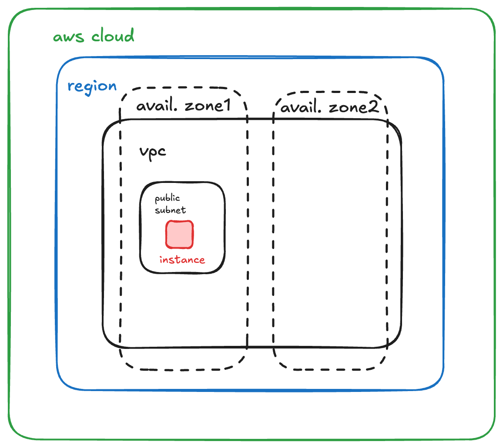

# Table of Contents

- [7 July 2025 (Day 3)](#7-july-2025-day-3)

## 7 July 2025 (Day 3)
- **Cloud Service Models**
    - **SaaS, PaaS, IaaS and their services**
        - **Advantages of SaaS:**
            - Cost-effective
            - Reduced time
            - Accessibility
            - Automatic updates
            - Scalability
        - **Advantages of PaaS:**
            - Simple and convenient
            - Cost effective
            - Efficiently managing the lifecycle
            - Efficiency
        - **Advantages of IaaS:**
            - Cost effective
            - Website hosting
            - Security
            - Maintenance. -> *no need to mangage the underlying data center or worry about deployment of new releases*
- **Difference between IAAS, PAAS and SAAS:**
    | Basis    | IaaS | PaaS | SaaS |
    |----------|------|------|------|
    | Uses    |  used by network architects    |  platform as a service    |  by end users    |
    | Access  |  resources like virtual machine and storage    |    gives access to run time env to deployment and development tools for application  |    gives access to end user  |
    |Model  |   service model provides visualization   |   cloud computing tools   |      |
    | Examples |    AWS Virtual provide cloud   |     Microsoft Azure |    IBM cloud Analysis  |

***Some point remaining in table***

- **Which cloud service is suitable for you?**
    - IAAS -> 
    - PAAS -> if your compsny requires a platform for building software products 
    - SAAS -> 

- **Difference between IAAS,PAAS,SAAS**


- **Types of cloud**
    - Public: Open to all to store and access information via the internet using the pay-per-usage method.  
        Resources are managed and operated by the cloud service provider.
        *Advantages*
        - Low Cost
        - location indepedent
        - save time
        - quickly and easy setup
        - business agility  -> elasticaly resize computer resources based on the organizations requirement.
        - Scalibility and reliability
        *Disadvantages*
        - Low Security 
        - Perfomance - as it depends on speed of internet connectivity
        - Less Customaizability 
        ---
    - Private: internal or corporate cloud.
        provides computing services to private internal network
        examples:
        - hp datacentre,microsoft, ubuntu
        *Advantages*
        - more control
        - Security and privacy
        - Improved Performance
        ---
    - Hybrid: a combination of public and private clouds.
        non critical activites are performed on public cloud while critical activities are performed on private cloud.
        *Advantages*
        - Flexibility and secureity
        - Cost effective
        - Scalability
        - Security
        - Risk Management
        *Disadvantages*
        - Networking issues
        - Infrastructure Compatibility
        - Reliability
        ---
    - Community: it is a cloud infra that allows systems and services to be accesible by a group of several organizations to share the information.
        *Advantages*
        - Cost effective. -- whole cloud is shared beetween several orgs o rcommunity
        - Security.  -- more secure than public but less than private 
        - Scalability - 
        - Flexibility
        - Sharing 
        *Disadvantages*
        - Limited control
        - Complexity
        - Vendor lock-in


## 11 July 2025 (Day 5)
### EC2 (Elastic Compute Cloud)
> **What are instances?** 

EC2 provides scalable computing capacity in the AWS cloud. Instances are virtual servers for running applications.

**Instance Types:**
- General Purpose
- Compute Optimized
- Memory Optimized
- Storage Optimized(low latency)
- Accelerated Computing(graphics optimzed)
- High Memory( high ram nitro optimized)

**important points:**
1. it provide scalable computing capacity in the AWS cloud.
2. you can use amazon ec2 to launch as many or as few virtual servers as you need, configure security and networking, and manage storage.
3. ec2 enables you to scale up and scale down the instances
4. storage options - elastic block storage (EBS) and instance store.

## Cloud Computing Architecture


### Components of Cloud Computing Architecture

- **Front-end:**  
    The interface that users interact with, such as web browsers or mobile apps.

- **Back-end (Cloud Side):**  
    The cloud infrastructure that powers applications and services.  
    **Key components include:**
    - Compute : virtual machines,container services
    - Storage: object storage, block storage, database(eg RDS, DynamoDB)
    - Networking:virtual networks(eg VPC), load balancer, DNS services(eg Route 53).
    - Monitoring and management tools:AWS CloudWatch, AWS CloudTrail, AWS Config.
    - Security: IAM, encryption, firewalls.

- **cloud resources:**  
    Hosted and managed by cloud service providers, such as AWS, Azure, or Google Cloud. these include:
    - data centres: physical infrastructure.
    - virtualization: hypervisors for resouce abstraction.
    - Middleware: software that enables integration between application.

4. **Networking:**  
    The communication protocols and services that connect the front-end and back-end, enabling data transfer and interaction.

5. **Cloud Storage:**
## Note: AWS is also known as ~~Amazon elastic lab produce.~~

## Hypervisor 
> hypervisor is a software that creates and runs virtual machines. It allows multiple operating systems to run concurrently on a single physical machine by abstracting the hardware resources. it act as a intermeditary,managing and allocating host resources. 

    - not clear(what sir was saying)

-  **Type 1 Hypervisor (Bare Metal):** 
    - runs directly on the host's hardware.
    - provides better performance and efficiency.
    - examples: VMware ESXi, Microsoft Hyper-V, Xen.
-  **Type 2 Hypervisor (Hosted):**
    - runs on top of a host operating system.
    - less efficient than Type 1.
    - examples: VMware Workstation, Oracle VirtualBox, Parallels Desktop. 

> ### imp: elastic beanstalk, aws lambda, aws sage maker


## aws global infrastructure
- its global infra is designed to provide high availability, low latency, and fault tolerance.
- this is acheived through-
    - **Regions:**  
        Geographical areas where AWS data centers are located. Each region is isolated from others to ensure fault tolerance.
        - each region has 3 or more Availability Zones (AZs). can be upto 6
    - **Availability Zones (AZs):**  
        Multiple isolated locations within a region, designed to be independent of each other. Each AZ has its own power, cooling, and physical security.
    - **Edge Locations:**  
        Used for content delivery and caching, reducing latency for end users.

#### Storage systems- 
    - SAN/NAS - Storage Area Network (SAN) and Network Attached Storage (NAS) are two types of storage solutions used in cloud computing. SAN is a high-speed network that provides access to consolidated block-level storage, while NAS is a file-level storage solution that allows multiple users to access and share files over a network.


## 14 July 2025

## AWS Cloud Practitioner
- Walkthrough of Amazon EC2 instance creation
  1. **Select an AMI** (Amazon Machine Image) that serves as a template for your instance.
  2. **Instance Type:** Choose the hardware configuration for your instance, such as CPU, memory, and storage.
     - Instance type categories include:
       - General Purpose
       - Compute Optimized
       - Memory Optimized
       - Storage Optimized
       - Accelerated Computing
     - Instance type naming
       - Example: t2.micro
         - T is the family name,
         - 2 is the generation, and
         - micro is the size.
  3. **Network Settings**
  4. **IAM Role**
  5. **User Data**
  6. **Storage Options**
     - **Amazon Elastic Block Store (EBS):**
       - Provides persistent block storage for EC2 instances
       - Can be attached to an instance as a root volume or additional data volumes
       - Supports snapshots for backup and recovery
     - **Amazon EC2 Instance Store:**
       - Provides temporary storage that is physically attached to the host machine
       - Data is lost when the instance is stopped or terminated
       - Suitable for temporary data or caching
     - **Other options:**
       - Amazon EFS (Elastic File System)
       - Amazon Simple Storage Service (S3)
  7. **Tags**
  8. **Security Group**
  9. **Key Pair**

  


        ```
        ┌───────────────┐          ┌───────────────┐          ┌───────────────┐
        │               │          │               │          │               │
        │    IAM Role   │ attached │  EC2 Instance │ accesses │   S3 Bucket   │
        │  (permissions)│ ────────>│  (runs app)   │ ────────>│  (data store) │
        │               │    to    │               │          │               │
        └───────────────┘          └───────────────┘          └───────────────┘
        ```


  