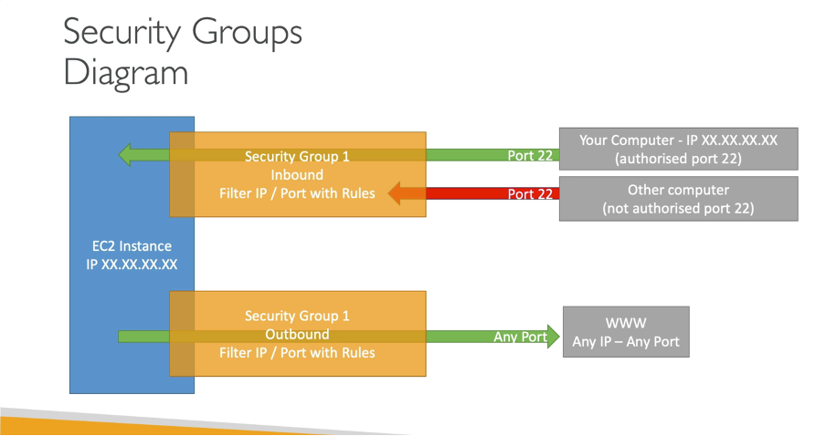
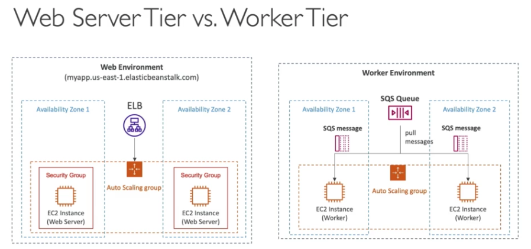
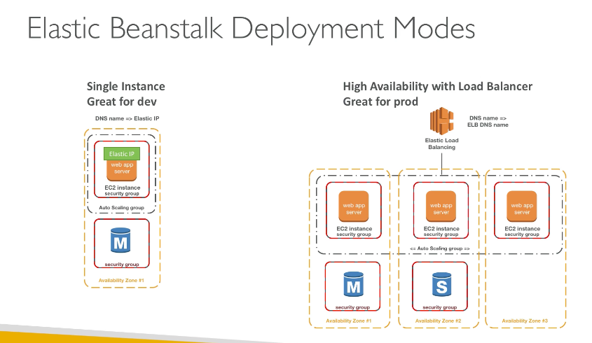

## module 2
## 14 July 2025

## Introdction to security groups
- Security groups act as virtual firewalls for your Amazon EC2 instances to control inbound and outbound traffic.
- They allow you to specify rules that determine which traffic is allowed or denied based on protocols, ports, and source/destination IP addresses.
- Security groups are stateful, meaning if you allow an incoming request, the response is automatically allowed, regardless of outbound rules.
- They regulate :
    - Access to Ports
    - authorized IP Ranges - Ipv4 and Ipv6
    - Control of inbound networl(from other to the instance)
    - Control of outbound network(from the instance to other)

|Type|Protocol|Port Range|Source/Destination|
|---|---|---|---|
|SSH|TCP|22|
|HTTP|TCP|80|
|HTTPS|TCP|443|
|Custom TCP Rule|TCP|<port number>|<IP address or CIDR block>|

### Security group diagram

## Classical ports to know
- **SSH**: Port 22 (used for secure shell access)
- **HTTP**: Port 80 (used for web traffic)
- **HTTPS**: Port 443 (used for secure web traffic) 
- **RDP**: Port 3389 (used for remote desktop protocol) 
- **FTP**: Port 21 (used for file transfer protocol)
- **SFTP**: Port 22 (used for secure file transfer protocol)

## 16 July 2025
   **Instance Type:** Choose the hardware configuration for your instance, such as CPU, memory, and storage.
     - Instance type categories include:
       - General Purpose
       - Compute Optimized
       - Memory Optimized
       - Storage Optimized
       - Accelerated Computing

1. General Purpose: 
    - Balanced compute,memory, and networking resources.
    - Examples: t series (burstable performance) (e.g., t2.micro, t3.medium)
    - M series (e.g., m5.large, m6g.xlarge)
2. Compute Optimized:
    - High performance for compute-intensive workloads.
    - Ideal for machine learning inference,HPC, and gaming.
    - Examples: c series (e.g., c5.large, c6g.xlarge)
3.  Memory Optimized:
    - High memory to cpu ratio for memory intenstive applications.
    - Ideal for in-memory databases and real-time big data analytics.
    - Examples: r series (e.g., r5.large, r6g.xlarge)
4. Accelerated Computing Instances:
    - Use hardware accelerators like GPUs or FPGAs for specific workloads.
    - Ideal for machine learning training, graphics rendering, and video transcoding.
    - Examples: p series (e.g., p3.2xlarge), g series (e.g., g4dn.xlarge)
5. Storage Optimized:
    - High disk throughput and IOPS for data-intensive applications.
    - Ideal for NoSQL databases, data warehousing, and log processing.
    - Examples: i series - optimized for high IOPS Storage (e.g., i3.large, i3en.xlarge), d series - optimized for dense storage workloads (e.g., d3.large, d3en.xlarge)
6. Network Optimized:
    - Designed for high network bandwidth and low latency.
    - Ideal for applications that require high bandwidth and low network jitter.
    - Examples: n series (e.g., n2d.large, n2.xlarge)

## Elastic Beanstalk
- **Elastic Beanstalk** is a Platform as a Service (PaaS) that simplifies the deployment and management of applications in the AWS cloud.
- A manaed servive that automatically handles - 
    - Deployment
    - Load balancing
    - Auto-scaling
    - Analysis and Debugging
    - Logging
- **Key Features:**
  - Supports multiple programming languages and frameworks, including Java, .NET, Node.js, Python, Ruby, Go, and Docker.
  - Provides a web-based management console for easy application deployment and monitoring.
  - Automatically provisions the necessary resources (EC2 instances, load balancers, etc.) based on the application's requirements.
  - Allows developers to focus on writing code without worrying about infrastructure management.
- **Steps**
    1. Upload your application code - use the aws management console or CLI to upload your application code.
    2. Elastic Beanstalk Provisions Infrastructure - It automatically creates
        - EC2 instances
        - Elastic Load Balancer(ELB)
        - Auto Scaling group
        - Security Groups
        - Amazon RDS (if needed)
    3. Application Deployment - EB configures the environment and deploys your application
    4. Auto Scaling and Monitoring
    5. Application Updates

- **Componenets**
    - Application:collection of Elastic Beanstalk components(environments,version,configurations)
    - Application Version: An iteration of your application cde
    - environment
        - collection of aws resources running an application version
        - Tiers : web server environment & worker environment tier

create Application    -> upload version -> launch environment -> manage environment

- Scale based on number of SQS messages.
- Can push messages to SQS queue from another web server tier

## Web Service Tier

- A web server environment is designed to run web applications that handle HTTP(s) requests from users via an Elastic load Balancer

- **How It works**
    - Elastic brainstalk provisions EC2 Instances.
    - It configures a load balancers and auto scaling group
    - EC2 insctances rin on web server.
    - The environment automatically manages scaling and monitoring.

- **Architecture**
    - User Request -> load balancer-> Ec2 web serveer -> Application code-> Database(optional)

## Worker Tier
- A worker environment is designed for processing background jobs that do not require immediate response 
- **How it works**
    - eb provisions ec2 instances running a worker prcoess
    - it creates an amazon simple queue service(SQS) queue.
    - the worker tier listens to the SQS queue fro tasks
~~Not Done Completly

